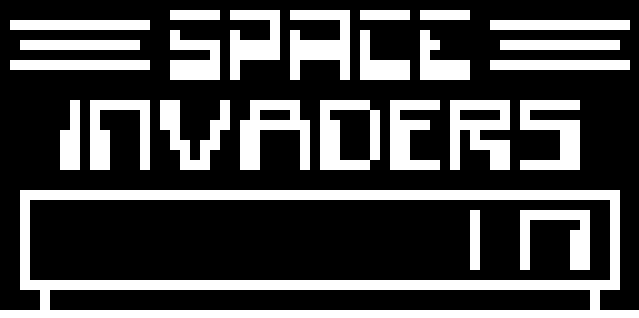

## Summary
This is a Chip 8 emulator written in rust using piston for input and graphics.



## Why Chip 8?
Chip 8 is a very simple system and is a good entrypoint to learning about emulator design.

### Purpose
I wrote this emulator to learn more about underlying CPU architecture and to learn more about how one would go about designing and writing an emulator.

## Usage
To build from source, install the rust compiler and cargo on your system. Then run: `cargo run <path_to_binary>` to launch the emulator.

## Controls
Here are the controls for the emulator:

### System controls
```
Number 1         => 1
Number 2         => 2
Number 3         => 3
Number 4         => C
Q                => 4
W                => 5
E                => 6
R                => D
A                => 7
S                => 8
D                => 9
F                => E
Z                => A
X                => 0
C                => B
V                => F
```

### Emulator controls
```
[                => Decrease CPU frequency by 10 Hz (lowest is 1 Hz)
]                => Increase CPU frequency by 10 Hz
P                => Pause emulation
M (while paused) => Step by 1 cycle
Esc              => Quit the emulator
```
